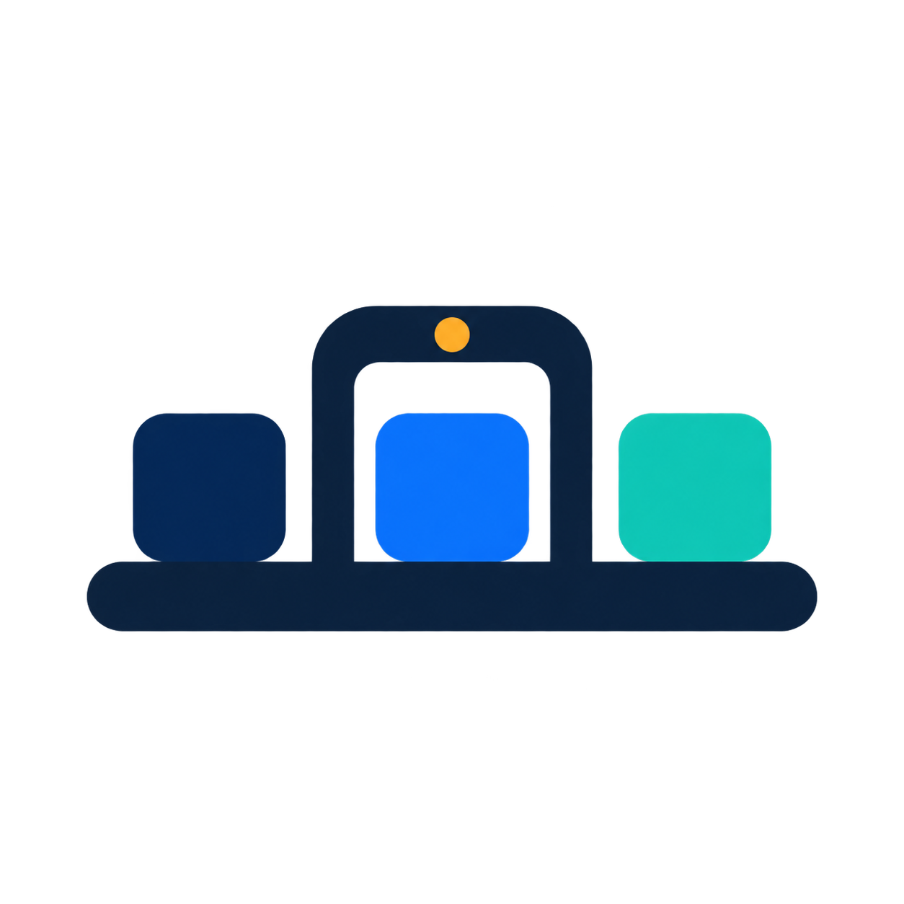
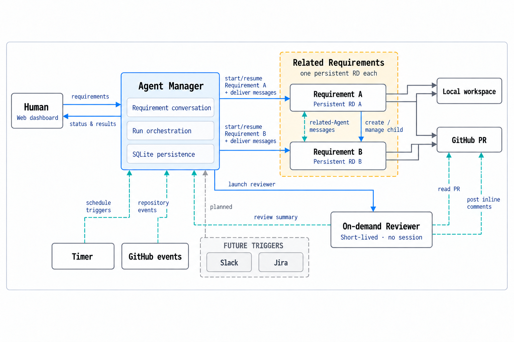

  

<h1 align="center">Code Factory</h1>

<strong>From requirement to reviewed pull request, keep every coding-agent loop visible and under human control.</strong>

  

Code Factory is a **local control plane for agent-driven software delivery**. It turns each requirement into a persistent development loop that connects a human, an RD coding agent, the local workspace, GitHub pull requests, on-demand AI reviewers, and external events routed through Agent Triggers in one Web dashboard.

It is designed for developers and engineering teams that already use **Codex** or **Claude Code**, but need more than isolated terminal sessions: durable context, visible progress, human intervention, PR feedback, and an auditable conversation around the work.

## Product Positioning

Code Factory sits between an issue tracker, an agent session manager, and a pull-request control center:

- **Requirement-driven:** work starts from a concrete requirement instead of an ad-hoc prompt.
- **Persistent:** every requirement owns a long-lived RD session that can be resumed across multiple runs.
- **Human-controlled:** people can add context, queue corrections, interrupt a run, and decide when work is done.
- **Trigger-connected:** Agent Triggers connect external event sources to the delivery loop. Built-in GitHub PR triggers currently handle status, reviews/comments, CI failures, and merge conflicts, while the source-neutral boundary is designed to support systems such as Slack and Jira.
- **Local-first:** agents run in your existing repository with your installed CLI tools, project instructions, and credentials.

Code Factory is not a hosted IDE or a generic agent pool. It coordinates the delivery workflow around coding agents while leaving code execution, Git, and GitHub access in the developer's own environment.

The current implementation supports headless **Codex** and **Claude Code** agents.

## Quick Start

~~~bash
cd /path/to/the/repository/to-manage
npx --package @luoyixin/code-factory code-factory-agent-manager start --daemon
~~~

The startup directory becomes the managed workspace. The dashboard is available at [http://127.0.0.1:4310](http://127.0.0.1:4310) by default.

Prerequisites, daemon operation, configuration, CLI options, and log locations are documented in [Running Code Factory](docs/running-code-factory.md). To install dependencies or run a source checkout manually, see the [Development guide](docs/development.md).

## How It Works

~~~mermaid
flowchart LR
  H[Human] <--> W[Web dashboard]
  W <-->|HTTP + SSE| M[Agent Manager]
  M <--> DB[(SQLite)]
  M -->|Create or resume| RD[Long-lived RD session Codex or Claude Code]
  M -->|Request review| RV[Short-lived Reviewer Codex or Claude Code]
  RD -->|Edit and test| WS[Local workspace]
  RD -->|Create or update PR| GH[GitHub]
  RD -->|code-factory-cli| M
  RV -->|Review comments| GH
  RV -->|Reviewer summary| M
  GH -->|Current PR events| T[Agent Triggers]
  EXT[Slack / Jira / more] -.->|Future sources| T
  T -->|Current: deliver to existing Requirement| M
  T -.->|Future: create Requirement| M
~~~

1. A human creates a Requirement and chooses Codex or Claude Code, optionally pinning a model and reasoning effort. Code Factory creates a dedicated, persistent RD session for it.
2. Agent Manager starts or resumes that agent in the managed workspace. Messages sent during a run are queued; the human may explicitly interrupt when an immediate correction is needed.
3. The RD agent edits and tests the repository, then uses the bundled `code-factory-cli` to register any pull request it creates or propose separate follow-up work.
4. Agent Triggers listen or poll for external events, normalize and deduplicate them, and route them into the Requirement conversation. The current built-in triggers observe GitHub PR state, comments and reviews, CI failures, and merge conflicts. An idle RD session resumes immediately; a running session consumes the new messages after its current run.
5. A human can request a short-lived AI review for an open PR with its own provider, model, and reasoning effort. Review results return to the same conversation and wake the original RD session to continue the loop.

The Agent Trigger boundary is intentionally source-neutral, but its current message contract targets an existing Requirement. Dynamic trigger discovery and configuration, Slack and Jira sources, and triggers that create new Requirements are future extensions rather than implemented behavior.

Different Requirements can run concurrently, while each Requirement has at most one active RD run. Requirement state, conversations, runs, sessions, PR metadata, and Agent Trigger receipts are persisted in SQLite.

Agent Manager places `code-factory-cli` on every RD process's `PATH` and injects its API URL, Requirement ID, and Session ID through the environment. The RD prompt names the relevant commands and leaves their arguments to `code-factory-cli --help`; raw HTTP details remain an internal transport contract.

For the complete domain model, state machines, concurrency rules, and delivery semantics, see [Final architecture and domain model](docs/architecture.en.md).

## Web Dashboard

The bundled dashboard provides three views:

- Requirement board: `TODO / DOING / Waiting for confirmation / DONE`
- Pull Request board: `DRAFT / OPEN / CLOSED / MERGED`
- RD Session board: `Idle / Running / Waiting for human / Failed / Completed`

Opening a Requirement shows its description, linked PRs, run information, and unified Human/RD/Reviewer conversation. Messages support images and file attachments. New input can be queued while RD is running, or the current run can be interrupted so the same session handles the correction immediately. Requirement and Reviewer forms provide provider-specific model dropdowns populated by an Agent Manager catalog that refreshes every 24 hours.

The dashboard supports light and dark modes from the top-right theme control, remembers the selected theme, and follows the operating-system preference until one is selected. It also supports English and Simplified Chinese, remembers the selected locale, and initially follows the browser language. Its Agent Manager settings dialog persists workspace configuration and identifies changes that require a restart.

All three boards share a creation-time filter with options for the last 24 hours, 7 days, 30 days, 90 days, or all time. The default view shows items created in the last 7 days.

The Web dashboard, HTTP API, and SSE event stream run in the same process and use the same port. No separate Web deployment is required.

## Security Model

Every headless RD and Reviewer invocation skips interactive CLI approval and sandbox checks. Agents therefore inherit the launching user's filesystem, network, and command-execution permissions. Start Agent Manager only inside a trusted workspace and expose its HTTP port only to trusted users and networks.

## Versioning and releases

Code Factory uses Semantic Versioning and is published as [`@luoyixin/code-factory`](https://www.npmjs.com/package/@luoyixin/code-factory). The installed version is available through `code-factory-agent-manager --version`, `code-factory-cli --version`, the startup banner, and `GET /api/health`. See the [release guide](docs/releasing.md) for version preparation, the tag workflow, verification, and recovery rules.

## License

Code Factory is licensed under the [Apache License 2.0](LICENSE).

## Design Documentation

- [Running Code Factory](docs/running-code-factory.md)
- [Development guide](docs/development.md)
- [Final architecture and domain model](docs/architecture.en.md)
- [Headless Agent Runner](docs/agent-runners.md)
- [Agent Manager HTTP API Reference](docs/agent-manager-api.md)
- [HTTP and event protocol](docs/protocol.md)
- [Development roadmap](docs/roadmap.md)
- [Release guide](docs/releasing.md)

## Current Boundaries

The current implementation includes the Agent Manager core, a supervised daemon mode with automatic process restart, SQLite Store, HTTP/SSE API, Codex and Claude Code adapters, conversation-driven RD continuation, PR tracking, manually triggered Reviewer runs, and the bundled Web dashboard.

The `AgentTrigger` lifecycle and extension API are currently code-level, and every delivered trigger message must target an existing Requirement. Dynamic trigger discovery/configuration, Slack and Jira sources, and trigger-created Requirements remain future work. GitHub synchronization currently uses local `gh` polling rather than webhooks. Stale-review indicators after a head-SHA change, local access tokens, detailed tool-execution logs, and Manager-enforced worktree isolation also remain future work. RD Agents are instructed to create or reuse a Requirement-specific Git worktree before changing code, but Agent Manager does not provision or enforce that isolation; every child process still starts in the shared Manager workspace.
