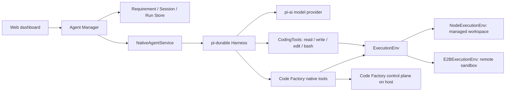

# Native Agent Implementation

Native Agent is Code Factory's third RD Agent provider. It uses pi-durable for persistent conversations. It shares Code Factory's Requirement, AgentSession, AgentRun, message, and pull request state machines with the headless Codex and Claude Code adapters, while a pi-durable Harness inside Agent Manager runs its model loop and dispatches its tools.

This guide covers the Native Agent core and its E2B execution environment extension. See the [architecture](architecture.en.md) and [API reference](agent-manager-api.md) for the canonical business state and HTTP contracts.

## Runtime location and call flow

**The Agent runs on the host; the sandbox is the tools' execution environment.** Agent Manager hosts the model client, Harness, conversation SQLite database, model credentials, and Code Factory control-plane tools. With E2B selected, CodingTools perform file and command operations remotely through the E2B SDK. The Agent runtime does not move into the sandbox. `ExecutionEnv` is a shared backend for tools such as `read`, `write`, `edit`, and `bash`, rather than a separate tool chosen by the model.

[`NativeAgentService`](../packages/agent-manager/src/native-agent.ts) opens one workspace-level Harness. It creates or resumes a pi-durable conversation for each Requirement and stores the conversation ID as `AgentSession.nativeSessionId`. Requirements have separate conversations, while later Runs of one Requirement resume its conversation. Forking a Requirement creates a new pi-durable conversation from the source conversation's latest entry; the fork does not share subsequent context with its source.

## RD Run lifecycle

1. Agent Manager reads unconsumed Human, Reviewer, and selected System inputs from `requirement_messages`, creates an `AgentRun`, and resolves its model, reasoning effort, and `sandboxId`.
2. NativeAgentService creates or resumes the conversation, configures its model, `cwd`, and RD instructions, and submits the input to pi-durable. The default model is `openai/gpt-5.4`; model IDs use `provider/model` format.
3. The Harness calls the model through pi-ai. The model invokes CodingTools or Code Factory native tools. Harness events become Code Factory messages and tool traces, exposed through ManagerEvents, SSE, and the dashboard.
4. Agent Manager advances the RD message-consumption cursor only after a successful Run. Failed, timed-out, or interrupted Runs retain their input for a later retry. A Session has at most one active RD Run; different Requirements may run concurrently.

The pi-durable conversations live in the workspace's `native-agent.sqlite`. Requirement, Run, and message records live in Agent Manager's Store. These persistence layers hold model context and product state, respectively.

## Model authentication

The dashboard's **Agent Manager configuration → Runtime settings → Native Agent authentication** panel saves OpenAI and Anthropic API keys or starts OpenAI and Codex subscription login. OpenAI login presents an authorization link and, when needed, a manual callback prompt; Codex subscription login uses a device code. The dashboard polls login status and can cancel a login. Model credentials live in a separate owner-only `native-agent-auth.sqlite` file. Credential-status responses expose only the source; login responses expose an authorization link or device code, never an API key or token. When no credential is saved, Agent Manager can still use `OPENAI_API_KEY` or `ANTHROPIC_API_KEY` from its process environment. Changes apply to later Runs without restarting Agent Manager.

## Execution environments and sandboxes

| Selection | Where files and commands run | Where the conversation and model client run |
| --- | --- | --- |
| Local execution | The managed workspace path, without an additional worktree or process isolation | Agent Manager host |
| E2B cloud sandbox | The selected sandbox's remote Git working directory through `E2BExecutionEnv` | Agent Manager host |

The Sandboxes page creates or attaches E2B sandboxes, collecting `E2B_DOMAIN` and `E2B_API_KEY`. A Sandbox record holds the remote ID, working directory, sharing mode, and credential reference; the API key lives in a separate owner-only credential file. Provisioning a new sandbox requires a repository HTTPS URL and prepares a remote Git checkout. Attaching an existing sandbox verifies its checkout without overwriting it. The remote environment needs Git, `gh`, and working GitHub authentication. Lifecycle actions check status, pause, resume, and delete a sandbox.

Multiple Native Agents may select one `shared` sandbox or different sandboxes. A `dedicated` sandbox is limited to one Requirement. They share files and command environment, **not pi-durable conversations**. Concurrent Agents in one sandbox can edit the same file; shared mode provides neither separate Git worktrees nor automatic conflict resolution. The E2B `ExecutionEnv.id` identifies a remote filesystem by domain and sandbox ID so pi-durable can coordinate file operations against that filesystem.

## Steering and stopping

A normal reply is appended to the Requirement message stream first. New messages arriving during a Run queue without implicitly interrupting it. When a human explicitly requests Steering and newer input exists, Agent Manager queues it even if the Harness is still opening. Once the first submission is ready, NativeAgentService submits the new direction with pi-durable's `whenBusy: "steer"`. Attachment paths and metadata use the same message format as a new RD Run. Agent Manager advances the Run's input cursor only after pi-durable accepts that submission; an input that cannot be steered stays queued for a later Run. The model receives accepted Steering after the current tool round, and the same `AgentRun` continues. An explicit Stop Run aborts the conversation; if it arrives before the first submission, NativeAgentService skips that submission. Only a successful Run consumes its original input and accepted Steering messages.

## Native tools and the control-plane boundary

NativeAgentService installs CodingTools in the pi-durable registry and registers `pr_register`, `gh_pr`, `requirement_propose`, `requirement_action`, `requirement_related`, `requirement_message`, `timer_register`, `timer_show`, and `timer_cancel`. These tools have typed parameters, so the model does not need to construct CLI commands from appended system-prompt instructions.

Requirement, timer, and PR registration tools reuse `code-factory-cli` validation and HTTP behavior on the Agent Manager host. The `pr_register` GitHub metadata lookup also uses the host's `gh`. The `gh_pr` tool runs through the selected `ExecutionEnv`, so with E2B it invokes `gh pr` in the remote repository. After creating a PR or changing its metadata, the Agent must still call `pr_register`. The GitHub reconciler owns the PR's draft, open, closed, and merged lifecycle state.

The boundary matters: E2B isolates file and shell operations routed through `ExecutionEnv`, **not Agent Manager or every native tool**. Model API credentials stay on the host. If the configured repository URL has exactly `github.com` as its host, Agent Manager may pass `GH_TOKEN` or `GITHUB_TOKEN` to remote GitHub commands. An attached sandbox or a repository on another host needs working `gh` authentication in the remote environment. Local execution inherits the launching user's local permissions, as the other local headless Agents do.

## Why this design fits Code Factory

Keeping the Harness, conversations, and control plane in Agent Manager lets one process coordinate long-lived Requirement sessions, message cursors, Steering, PR registration, and several Agents sharing a sandbox. Switching between local execution and E2B changes the `ExecutionEnv` without distributing model credentials to every sandbox.

Running the entire Agent inside a sandbox would make sense if the isolation requirement expands to **the Agent runtime, plugins, and every tool**. That design would also need an Agent runtime in each sandbox, model credential distribution, remote process recovery, conversation persistence, a control-plane connection, and concurrency coordination when several Agents share one sandbox. The current isolation of remote CodingTools should not be treated as isolation of the entire Agent.
