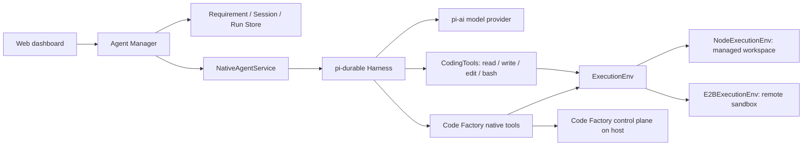

# Native Agent 实现说明

Native Agent 是 Code Factory 的第三种 RD Agent，使用 pi-durable 维护持久会话。它与 Codex、Claude Code 的 headless 适配器共用 Requirement、AgentSession、AgentRun、消息和 PR 状态机，但模型循环和工具调度由 Agent Manager 进程内的 pi-durable Harness 执行。

本文描述 Native Agent 核心及其 E2B 执行环境扩展。E2B 适配器位于叠加的 PR #119；单独检出核心 PR #118 时，只有本地执行可用。业务状态与 HTTP 字段以 [架构文档](architecture.en.md)和 [API 参考](agent-manager-api.md)为准。

## 运行位置与调用链

**当前是“Agent 在宿主机，沙箱作为工具的执行环境”**。模型请求、Harness、会话 SQLite、认证凭据和 Code Factory 控制面工具都在 Agent Manager 所在机器上；选用 E2B 时，CodingTools 的文件和命令操作通过 E2B SDK 在远端执行。Agent 进程本身没有搬进沙箱，`ExecutionEnv` 也不是单独供模型选择的一个工具，而是 `read/write/edit/bash` 等工具共同使用的执行后端。

核心入口是 [`NativeAgentService`](../packages/agent-manager/src/native-agent.ts)。它打开一个工作区级 Harness，为每个 Requirement 创建或恢复一个 pi-durable conversation，并把 conversation ID 保存为 `AgentSession.nativeSessionId`。不同 Requirement 的 conversation 各自独立；同一个 Requirement 的后续 Run 恢复原 conversation。Requirement fork 会从源 conversation 的最后一条记录建立新的 pi-durable fork，不与源会话共用后续上下文。

## 一次 RD Run

1. Agent Manager 从 `requirement_messages` 读取尚未成功消费的 Human、Reviewer 或 System 输入，创建 `AgentRun`，并决定模型、推理强度和 `sandboxId`。
2. NativeAgentService 创建或恢复 conversation，设置模型、`cwd` 和本次 RD 指令，然后向 pi-durable 提交输入。默认模型是 `openai/gpt-5.4`；模型 ID 使用 `provider/model` 格式。
3. Harness 调用 pi-ai 模型；模型调用 CodingTools 或 Code Factory native tools。Harness 事件被映射为 Code Factory 的消息和工具 trace，通过 ManagerEvents、SSE 与页面展示。
4. Run 成功后，Agent Manager 才推进 RD 消息消费游标。失败、超时或中断保留待处理输入，供后续 Run 重试。一个 Session 同时至多有一个 RD Run，不同 Requirement 可以并发运行。

pi-durable conversation 保存在工作区的 `native-agent.sqlite`；Requirement、Run、消息等业务记录保存在 Agent Manager 的 Store 中。这两个持久化层分别承担模型上下文和产品状态。

## 模型认证

Web 的 **Agent Manager 配置 → 运行时设置 → Native Agent 认证** 可保存 OpenAI、Anthropic API Key，或启动 OpenAI、Codex 订阅登录。OpenAI 登录显示授权链接和必要时的手动回调输入；Codex 订阅登录使用设备码。页面轮询登录状态，也可取消登录。模型凭据保存在独立、仅文件所有者可访问的 `native-agent-auth.sqlite`。凭据状态 API 只返回来源；登录 API 返回授权链接或设备码，不回传密钥或 token。未保存凭据时仍可使用 Agent Manager 进程中的 `OPENAI_API_KEY` 或 `ANTHROPIC_API_KEY`。新配置用于后续 Run，无须重启 Manager。

## 执行环境与沙箱

| 选择 | 文件与命令在哪里执行 | 会话与模型在哪里运行 |
| --- | --- | --- |
| Local execution | Agent Manager 管理的工作区路径；没有额外 worktree 或进程隔离 | Agent Manager 宿主机 |
| E2B cloud sandbox | 选定沙箱的远端 Git 工作目录，通过 `E2BExecutionEnv` 调用 SDK | Agent Manager 宿主机 |

Web 的沙箱页负责创建或接入 E2B 沙箱，创建时填写 `E2B_DOMAIN` 和 `E2B_API_KEY`。Sandbox 记录保存远端 ID、目录、共享模式与凭据引用；API Key 保存在独立的 owner-only 凭据文件中。新建沙箱需要仓库 HTTPS URL，并在远端准备 Git checkout；接入已有沙箱时校验现有 checkout，不覆盖它。远端需要 Git、`gh` 和可用的 GitHub 认证。生命周期操作包括状态检查、暂停、恢复和删除。

多个 Native Agent 可以选择同一个 `shared` 沙箱，也可以选择不同沙箱；`dedicated` 沙箱限制为一个 Requirement 使用。共享的是文件系统与命令环境，**不是 pi-durable conversation**。同一沙箱上的并发 Agent 可能修改同一文件，当前共享模式不提供 Git worktree 隔离或自动冲突解决。E2B `ExecutionEnv.id` 以域名和远端 sandbox ID 标识同一个文件系统，供 pi-durable 正确协调文件操作。

## Steering 与停止

普通回复先写入 Requirement 消息流。运行中的新消息默认排队，不会隐式打断 Run。人类显式选择 Steering 且存在更新输入时，Agent Manager 调用 `NativeAgentService.steer()`，将新方向以 pi-durable `whenBusy: "steer"` 提交到正在运行的 conversation；当前工具轮次结束后模型收到新方向，原 `AgentRun` 继续。显式 Stop Run 调用 conversation abort。只有成功的 Run 才消费其输入及已接纳的 Steering 消息。

## Native tools 与控制面边界

NativeAgentService 在 pi-durable registry 中安装 CodingTools，并注册 `pr_register`、`gh_pr`、`requirement_propose`、`requirement_action`、`requirement_related`、`requirement_message`、`timer_register`、`timer_show`、`timer_cancel`。这些是有类型参数的工具，不需要模型从追加的系统提示中拼出 CLI 命令。

需求、计时器和 PR 登记工具在 Agent Manager 宿主机复用 `code-factory-cli` 的校验与 HTTP 逻辑；`pr_register` 的 GitHub 元数据查询也使用宿主机的 `gh`。`gh_pr` 通过所选 `ExecutionEnv` 执行，因此选用 E2B 时是在远端仓库调用 `gh pr`。创建或修改 PR 后仍需调用 `pr_register`，PR 的 draft/open/merged 状态由 GitHub reconciler 管理。

这个边界需要明确：E2B 隔离的是通过 ExecutionEnv 发出的文件和 shell 操作，**不是整个 Agent Manager 或所有 native tools**。模型 API 凭据留在宿主机；配置的仓库 URL 主机名恰好为 `github.com` 时，Agent Manager 可以把 `GH_TOKEN` 或 `GITHUB_TOKEN` 传给远端 GitHub 命令。接入已有沙箱或使用其他仓库主机时，需要远端已有可用的 `gh` 认证。Local execution 与其他本地 headless Agent 一样，继承启动用户的本地权限。

## 为什么先采用这个形态

对当前 Code Factory，保持 Agent Manager 持有 Harness、会话和控制面比较合适：Requirement 的长会话、消息游标、Steering、PR 登记和多个 Agent 共享沙箱都由同一管理进程协调；切换本地或 E2B 只需要替换 ExecutionEnv。模型认证也无需分发到每个沙箱。

如果未来要求**整个 Agent、插件和所有工具都受远端沙箱约束**，才值得转向“agent in sandbox”。那需要在每个沙箱部署并维护 Agent runtime，解决模型凭据分发、远端进程恢复、会话持久化、控制面回连和多个 Agent 共享一台沙箱时的并发问题。当前实现不能把远端 CodingTools 的隔离等同于整个 Agent 的安全边界。
